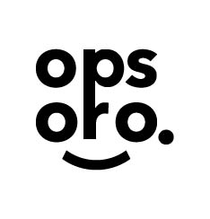

#About OPSORO

Welcome to OPSORO, an Open Platform for making Social Robots.

In this book, we will guide you through the whole process of making your own social robots. First, please read the introduction to make sure you do not oversee the basic & necessary steps.

This book is licensed under the Creative Commons Attribution-ShareAlike 4.0 license. The source can be found and modified on GitHub.
This is the version 1.0 of the OPSORO documentation, updated at Wed Dec 07 2016 09:23:05 GMT+0000 (UTC).